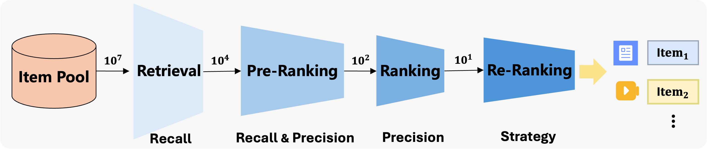

# Not All Candidates are Created Equal: A Heterogeneity-Aware Approach to Pre-ranking in Recommender Systems

### Heterogeneity-Aware Adaptive Pre-ranking 
In industrial recommender systems, the pre-ranking stage serves as a critical middle layer between retrieval and ranking, tasked with filtering thousands of candidates down to hundreds — all within millisecond-level latency budgets. However, these candidates are highly heterogeneous: some are easy to distinguish, while others closely resemble ground-truth positives. This mix leads to conflicting gradient signals during training and inefficient computation in deployment.

To tackle this, we propose HAP (Heterogeneity-Aware Adaptive Pre-ranking) — a unified framework that addresses both optimization conflict and computational inefficiency in large-scale pre-ranking.

HAP has been successfully deployed in Toutiao, one of the largest content recommendation platforms in China, yielding +0.05% user active days and +0.4% app usage time — substantial gains at industrial scale.

---

### Dataset Organization
ToutiaoRec is constructed by sampling 70 million user requests from the Toutiao feed scenario over 3 days, resulting in 313 million requests. The dataset includes real user feedback such as clicks, likes, comments, and more. For each request, we retain all exposed items, along with the ranking information across all pipeline stages. To handle the large volume of unexposed data, we sample negatives as follows: 1) Global random negatives (GN): randomly sampled from the entire candidate pool at a 1:2 ratio to exposed positives. 2) Ranking negatives (RN): 10 unexposed candidates ranked below position 50 in the ranking stage. 3) Pre-ranking negatives (PRN): 10 unexposed candidates ranked below position 200 in the pre-ranking stage. All types of negatives retain their ranking positions from the respective stages. In addition, the dataset includes 29 types of anonymized features, such as user behaviors and item attributes. Given the diverse content formats in Toutiao (articles, microblogs, short videos, etc.), each candidate is annotated with its content type. The code and data will be released.
