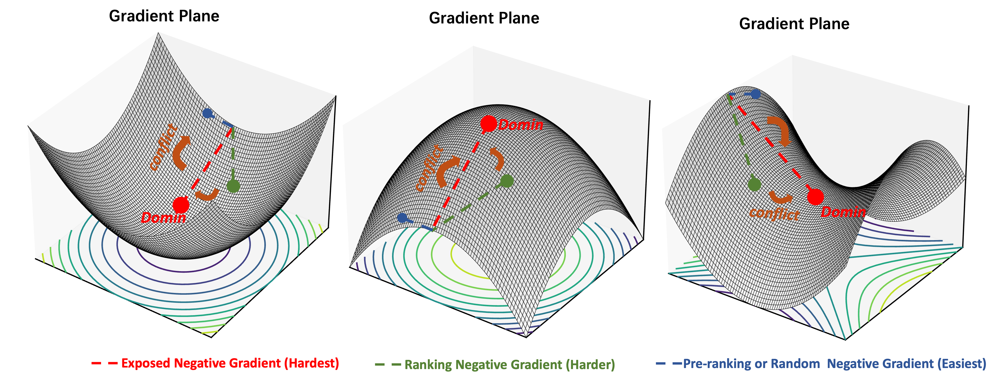
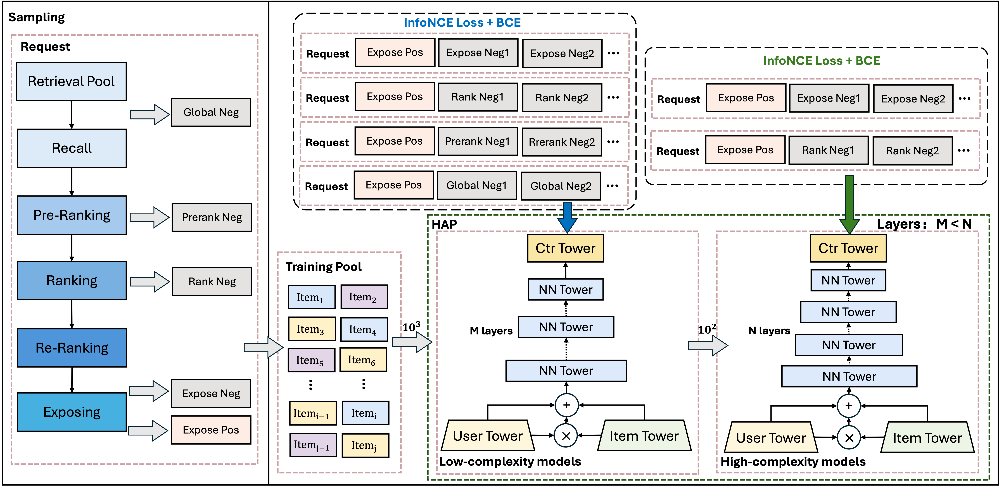

# Not All Candidates are Created Equal: A Heterogeneity-Aware Approach to Pre-ranking in Recommender Systems

### Heterogeneity-Aware Adaptive Pre-ranking 
In industrial recommender systems, the pre-ranking stage serves as a critical middle layer between retrieval and ranking, tasked with filtering thousands of candidates down to hundreds — all within millisecond-level latency budgets. However, these candidates are highly heterogeneous: some are easy to distinguish, while others closely resemble ground-truth positives. This mix leads to conflicting gradient signals during training and inefficient computation in deployment.

To tackle this, we propose HAP (Heterogeneity-Aware Adaptive Pre-ranking) — a unified framework that addresses both optimization conflict and computational inefficiency in large-scale pre-ranking.

HAP has been successfully deployed in Toutiao, one of the largest content recommendation platforms in China, yielding +0.05% user active days and +0.4% app usage time — substantial gains at industrial scale.

---

### ToutiaoRec Dataset

[Link](https://github.com/Toutiao-Rec/ToutiaoRec)
